# Final Project 
### Teknologi Komputasi Awan

**Kelas A**

**Kelompok 5**
|Nama|NRP  |
|--|--|
|Awang Fraditya|5027221055|
|Marselinus Krisnawan Riandika|5027221056|
|Nur Azka Rahadiansyah|5027221064|
|Sighra Attariq Sumere Jati|5027221068|

## Permasalahan
Anda adalah seorang lulusan Teknologi Informasi, sebagai ahli IT, salah satu kemampuan yang harus dimiliki adalah Kemampuan merancang, membangun, mengelola aplikasi berbasis komputer menggunakan layanan awan untuk memenuhi kebutuhan organisasi.(menurut kurikulum IT ITS 2023 😙)

Pada suatu saat teman anda ingin mengajak anda memulai bisnis di bidang digital marketing, anda diberikan sebuah aplikasi berbasis API File: app.py dengan spesifikasi sebagai berikut.

Kemudian anda diminta untuk mendesain arsitektur cloud yang sesuai dengan kebutuhan aplikasi tersebut. Apabila dana maksimal yang diberikan adalah 1 juta rupiah per bulan (65 US$) konfigurasi cloud terbaik seperti apa yang bisa dibuat?

## Rancangan Arsitektur dan Harga VM
- Berikut merupakan rancangan arsitektur yang kami rancang sebelumnya
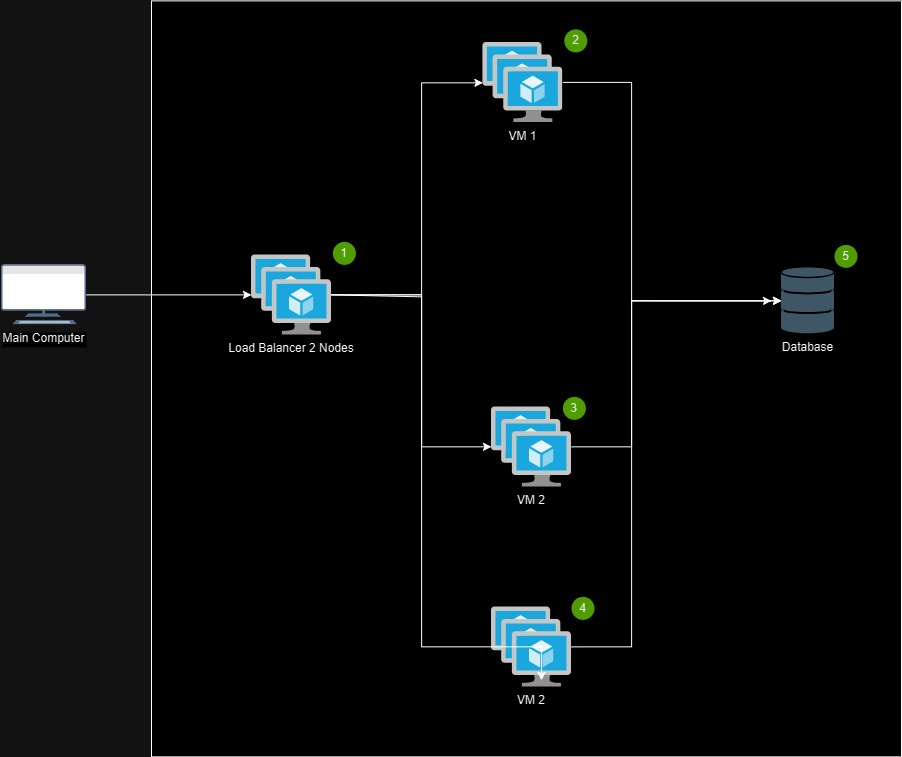

- Namun, dengan keberadaan resources yang terbatas, kami memutuskan untuk merubah rancangan kami menjadi seperti dibawah ini
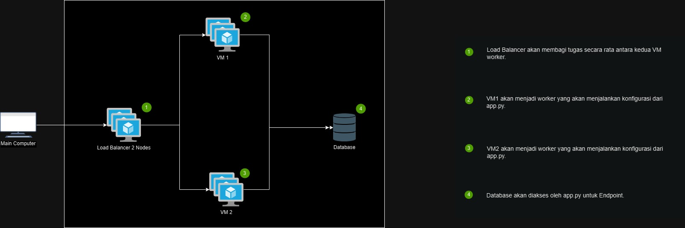

## Langkah Implementasi Arsitektur Cloud
1. Implementasi dapat dilakukan dengan melakukan login ke DigitalOCean dan membuat resources.
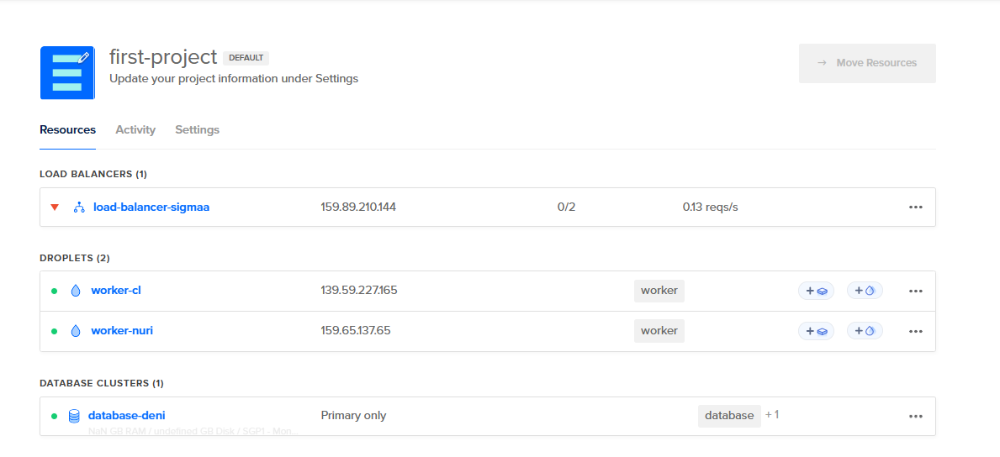

2. Kemudian buat dua droplets yang akan menjadi worker dengan spesifikasi sebagai berikut.
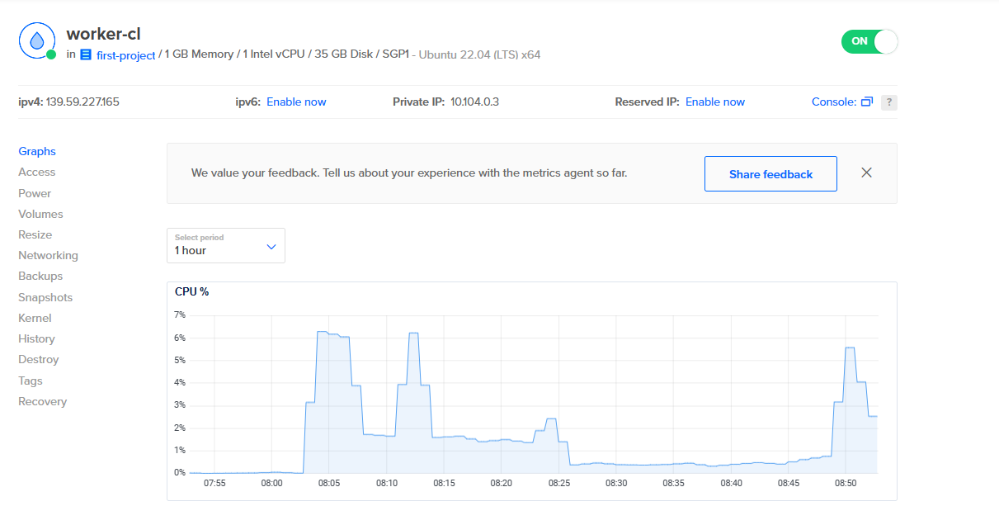
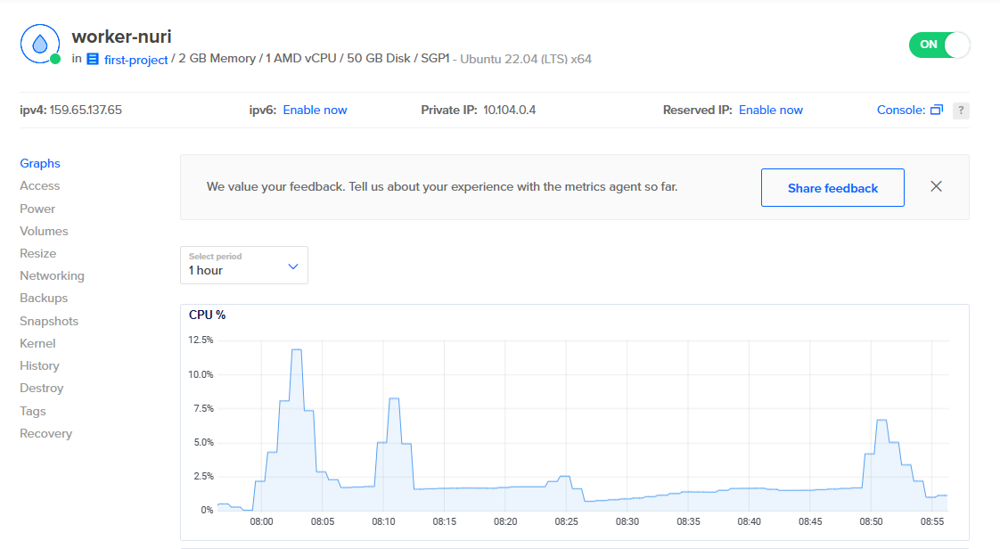

3. Setelah membuat droplet, dapat dibuat database yang nantinya akan dihubungkan ke worker.
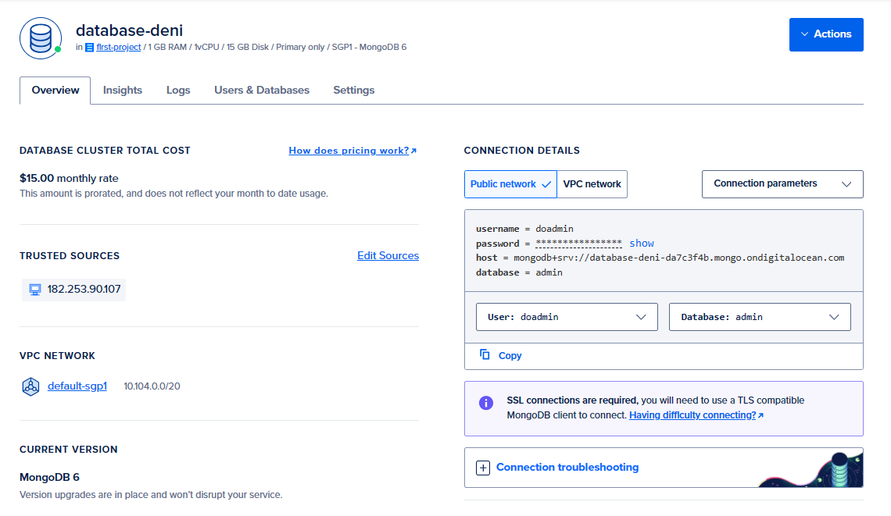

4. Lalu untuk menyeimbangkan pembagian tugas antara kedua worker, dibuatlah load balancer dengan dua node untuk masing-masing worker.
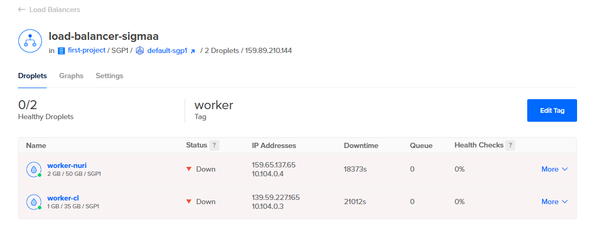

## Hasil Pengujian Endpoint API
1. Get All Orders
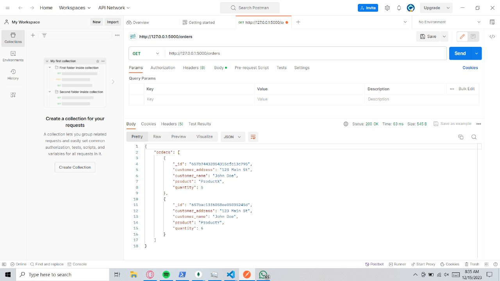

2. Get Specific Order by ID
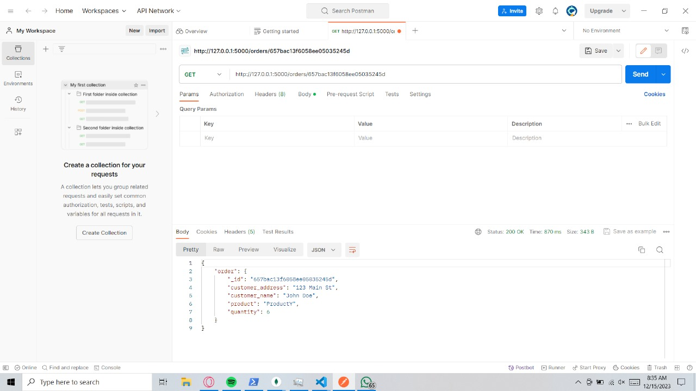
3. Create New Order
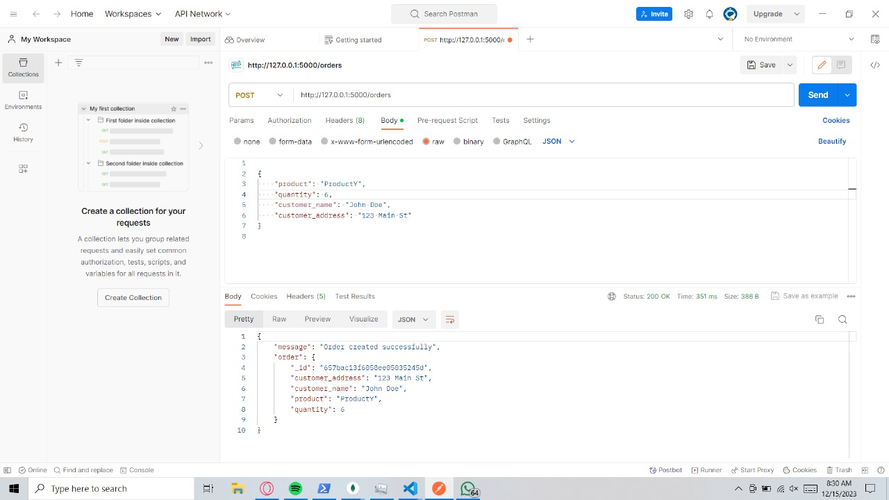

4. Update Order by ID
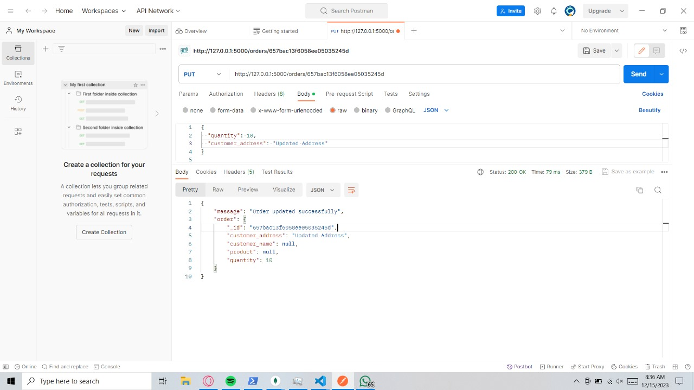

5. Delete Order by ID
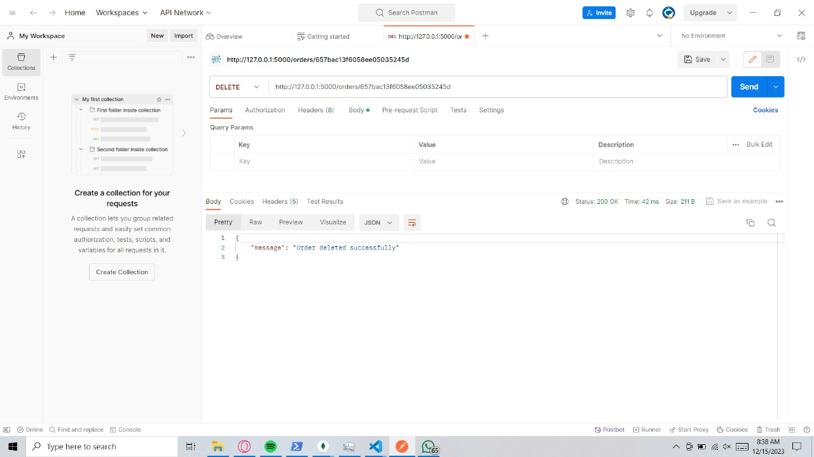

## Hasil Pengujian dan Analisis Loadtesting
1. Hasil pengujian melalui locust
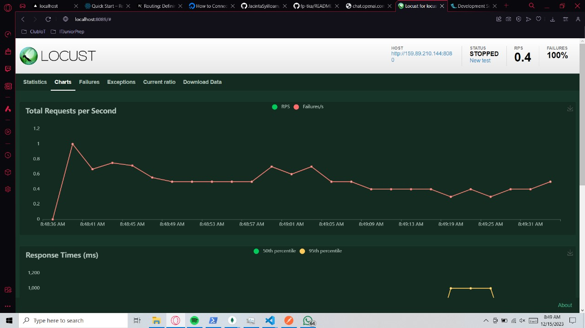
- Karena load balancer yang masih belum bisa mengirim sinyal dan membagi tugas dengan worker, maka worker juga tidak dapat berfungsi secara maksimal yang menghasilkan tingkat failure yang tinggi, yaitu 100%.

## Kesimpulan dan Saran
- Arsitektur cloud yang telah kami buat, meskipun memiliki potensi untuk mencapai hingga 200+ RPS, gagal dalam mencapai hal tersebut karena tingkat failure yang tinggi dalam load balancer.
`
- Kurangnya pemahaman kami dalam memperbaiki failing load balancer menyebabkan tugas yang seharusnya dibagi sama rata antara kedua worker tidak dapat dijalankan secara maksimal, sehingga menjadi penyebab rendahnya RPS yang kami miliki.

## REVISI
1. Poin Revisi : Simulasikan 1 load balancer dan 1 worker dalam 1 VM, upgrade spesifikasi dan kemudian lakukan testing ulang

2. Berikut merupakan spesifikasi VM kami yang telah diperbarui:
|   Nama VM   |   Fungsi VM   | Harga VM |
|:-----------:|:-------------:|:--------:|
| worker1 (2vCPU) | worker dan load balancer |   $32    |
| worker2 (1vCPU) |        worker            |   $8     |
|  database       |    data storing          |   $15    |

2. Melalui simulasi diatas, diperoleh hasil sebagai berikut:
   - 250.5 RPS saat Spawn Rate 100 dengan 1000 user.
   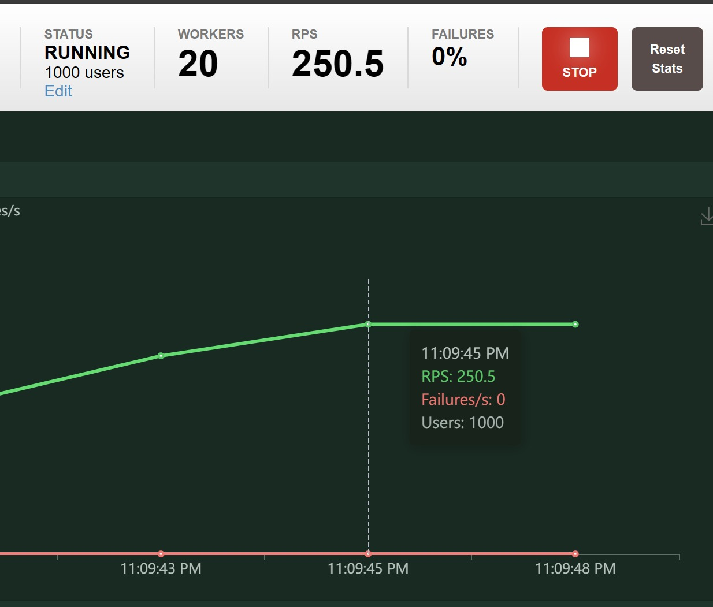

   - 247.5 RPS saat Spawn Rate 50 dengan 1000 user.
   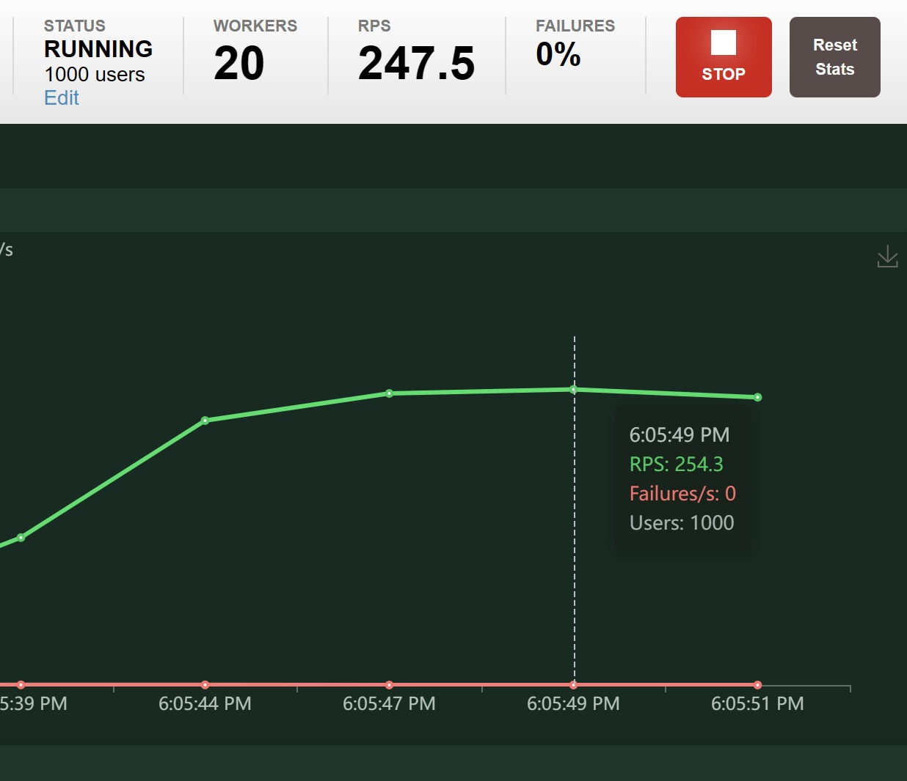

   - 223.6 RPS saat Spawn Rate 25 dengan 1000 user.
   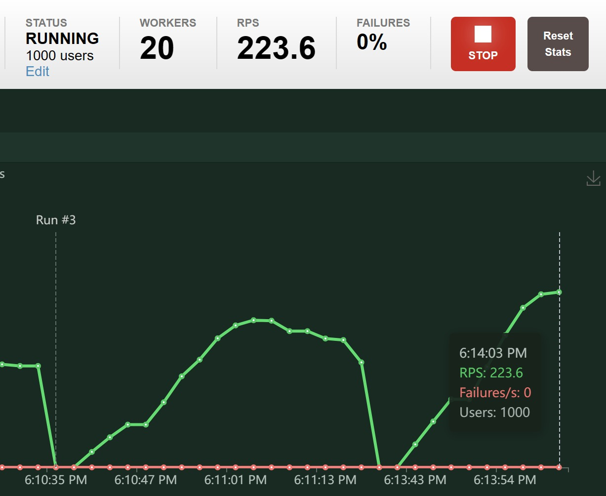

